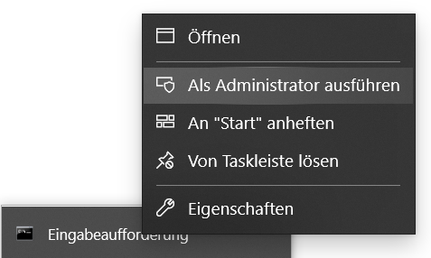
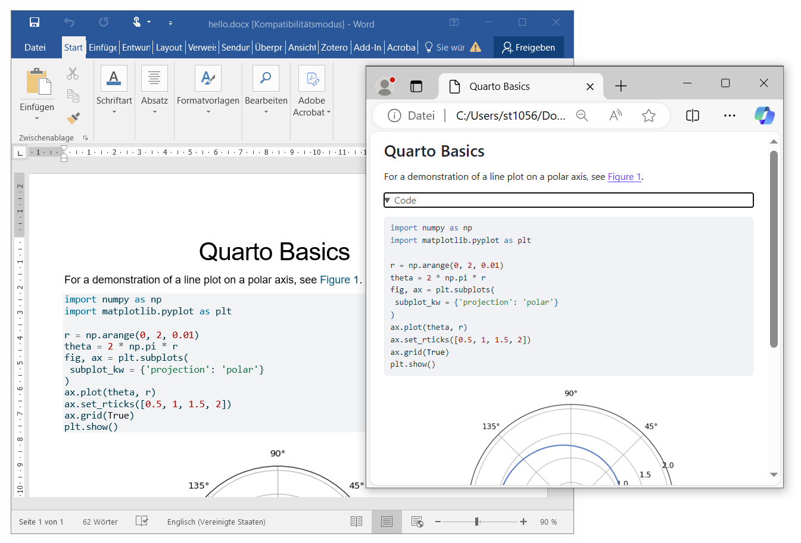
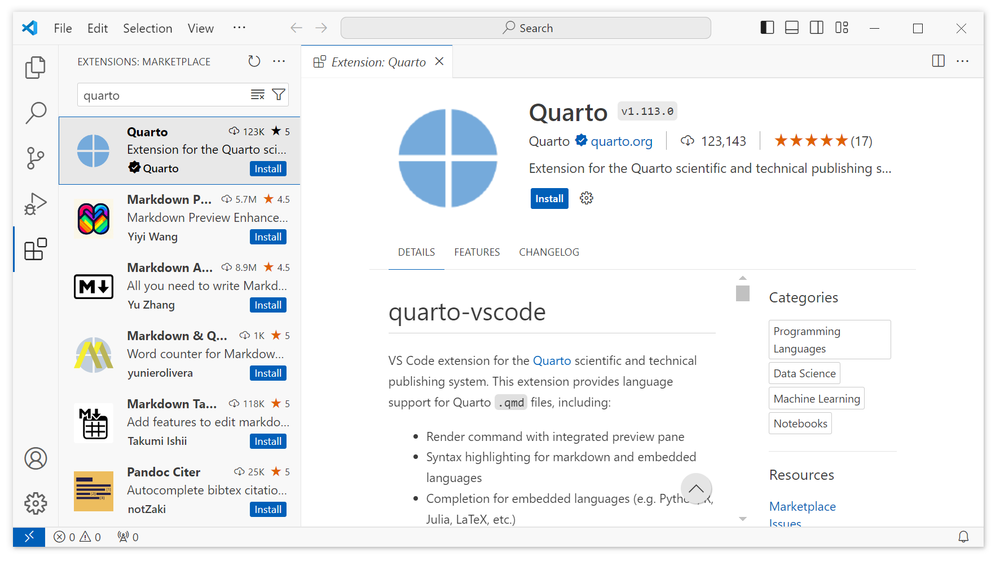

# quarto-course-template

An experiment to create professional documents using simple markdown text as input.

## Requirements

1. **Robust tooling** that is portable and can be saved/archived independently.
2. **Convenient text editing** with minimal markup, support for math and program code.
3. **Various output formats** such as HTML web pages, EPUB e-books, Microsoft Office files and PDF documents.

## Bill of Materials

**Device:**

-   Processor: Intel(R) Core(TM) i7-1065G7 CPU \@ 1.30GHz 1.50 GHz
-   RAM: 16,0 GB (15,6 GB verwendbar)
-   System Type: 64-Bit-Betriebssystem, x64-basierter Prozessor
-   Pen and Touch Input: Supported

**Operating System:**

-   Edition: Windows 10 Enterprise
-   Version: 22H2
-   Installed: 01.10.2020
-   OS Build: 19045.4651
-   Performance: Windows Feature Experience Pack 1000.19060.1000.0

**Software:**

- Publishing platform
  - [Quarto Command Line Interface (CLI)](https://quarto.org/docs/get-started/): Version `1.5.54`
- Python packages
  - [Matplotlib](https://matplotlib.org/) visualization library: `matplotlib`
  - [Plotly](https://plotly.com/python/) open source graphing library: `plotly`
  - [Jupyter](https://jupyter.org/) interactive computing platform: `jupyter`
- Personal development environment
  - [Visual Studio Code](https://code.visualstudio.com/download): `VSCode-win32-x64-1.91.0.zip`
  - [Quarto extension for Visual Studio Code](https://marketplace.visualstudio.com/items?itemName=quarto.quarto)  : `quarto.quarto-1.113.0.vsix`

## Set-up

### Install the Publishing Platform

Download an installer for the [Quarto Command Line Interface (CLI)](https://quarto.org/docs/get-started/) for your operation system of choice and install. Check if Quarto is working by opening a command line interface/text terminal and typing:

```         
quarto --version
```

The result should display the current version of your Quarto installation (e.g., `1.5.54`).

### Configure and Test the Publishing Platform

To configure and test the publishing platform, we will follow the [Tutorial: Hello, Quarto](https://quarto.org/docs/get-started/hello/vscode.html).

First, create a new file named `hello.qmd` and copy [the following content](https://quarto.org/docs/get-started/hello/text-editor.html) into it:

 ````
 ---
title: "Quarto Basics"
format:
  html:
    code-fold: true
jupyter: python3
---

For a demonstration of a line plot on a polar axis, see @fig-polar.

```{python}
#| label: fig-polar
#| fig-cap: "A line plot on a polar axis"

import numpy as np
import matplotlib.pyplot as plt

r = np.arange(0, 2, 0.01)
theta = 2 * np.pi * r
fig, ax = plt.subplots(
  subplot_kw = {'projection': 'polar'} 
)
ax.plot(theta, r)
ax.set_rticks([0.5, 1, 1.5, 2])
ax.grid(True)
plt.show()
```
````

The [Quarto tutorial](https://quarto.org/docs/get-started/hello/vscode.html) uses the Python packages `matplotlib` and `plotly`. Also, to process executable code blocks in a `.qmd` file, we depend on [Jupyter](https://jupyter.org/). After processing the executable code blocks, Jupyter converts the resulting comination of program code, markdown text, and generated data to plain markdown. This markdown is then processed by [Pandoc](https://pandoc.org/) to create the final output formats (e.g. HTML web pages, PDF documents, Microsoft Office files). 

> **Note:** We do not need to install [Pandoc](https://pandoc.org/) separately since it is bundled in Quarto internally. You can access it in the terminal with the command `quarto pandoc file.md -o out.html`.

Open a terminal in Admin mode (super user priviledges, see Fig. 1) and install the required Python packages:

```
pip install jupyter matplotlib plotly
```



> **Note:** We recommend installing these packages in a [Python virtual environment (*venv*)](https://docs.python.org/3/tutorial/venv.html) to protect the global operating system level Python installation.

```bash#
# Create a new venv named '.quarto-venv'
python -m venv .quarto-venv 

# Activate the venv (Unix/Linux)
source .quarto-venv/bin/activate  

# Activate the venv (Windows)
.quarto-venv\Scripts\activate.bat 

# Install packages
(.quarto-venv) > pip install jupyter matplotlib plotly 

# Deactivate the venv (optional)
deactivate 
```

Open a terminal and render the document (see Fig. 2):
```
quarto render hello.qmd --to html
quarto render hello.qmd --to docx
```



> **Note:** If you use a Python virtual environment (*venv*), you must render your Quarto documents within the activated *venv*.

To create PDF documents, install a recent distribution of TeX. Quarto recommends the use of TinyTeX:

```bash
quarto install tinytex
```

Open a terminal and render the document as a PDF document:
```bash
quarto render hello.qmd --to pdf
```


### Prepare the Personal Development Environment

Download [Visual Studio Code](https://code.visualstudio.com/download) as a compressed ZIP-file archive. We do not use an installer since we want to create a portable development environment that we can save and backup independently.

Unzip the archive and inspect the folder structure. Enable [portable mode](https://code.visualstudio.com/docs/editor/portable) by creating a `data` folder within VS Code's application folder:

```         
|- VSCode-win32-x64-1.91.0
|   |- Code.exe
|   |- data
|   |- bin
|   |- ...
```

Install the [Quarto extension](https://marketplace.visualstudio.com/items?itemName=quarto.quarto) for Visual Studio Code as shown in Fig. 3. Open Visual Studio Code (`Code.exe`), click on the *Extensions* button in the left panel, search for `quarto` and click on the *Quarto* Extension. In the  install the extension .



Save your custom development environment (the portable Visual Studio Code installation) by creating a ZIP-file archive of the VS Code's application folder after you installed the Quarto extension. You can rename the folder before creating the ZIP-file to reflect the distinctiveness of your development environment: `VSCode-win32-x64-1.91.0-quarto.zip`. Integrate the ZIP-file in your project's backup process.

### Prepare the Project Structure

Create a folder `examples` and move the file `hello.qmd` and the generated documents to the folder. We will use the folder for isolated examples and experiments.

Create the following folders:
- `lecture` -- a template for a [slidedoc](https://www.duarte.com/resources/books/slidedocs/) that represents a lecture.
- `slides` -- a template for presentation slides.
- `book` -- a template for a book.

## Next Steps

### Create a Book Template

Follow the [Creating a Book](https://quarto.org/docs/books/#overview) tutorial from the Quarto web page:

In your Visual Studio Code developmnent environment, execute the ***Quarto: Create Project*** command. Then, select ***Book Project*** and choose the `book` folder as the parent directory.

In the terminal, move to the `book` folder and execute quarto:

```bash
cd book
quarto render           # render all formats
quarto render --to pdf  # render PDF format only
```

### More Infos

- [Tutorial: Hello, Quarto](https://quarto.org/docs/get-started/hello/vscode.html)
- [Python Virtual Environment Usage on Raspberry Pi](https://learn.adafruit.com/python-virtual-environment-usage-on-raspberry-pi/overview)
- [Enough Markdown to Write a Thesis](https://biostats-r.github.io/biostats/quarto/)
- [quarto-thesis-hsnr](https://git.zilium.de/produnis/quarto-thesis-hsnr), a Quarto book template for a bachelor thesis in german language.
- Is there a way to "include" a excel table in the qmd file. [#6373](https://github.com/quarto-dev/quarto-cli/discussions/6373)
- [Quarto PhD Data Science Thesis Template: Edinburgh University](https://github.com/james-d-h/quarto-phd-thesis)

